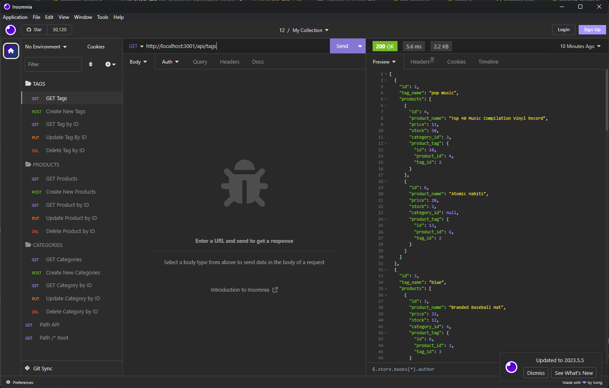

# E-commerce Back End

## E-commerce Back End
This repository was created to allow the users to their E Commerce backend records using API endpoints.

This project contain a few files that allows this E commerce backend to run and create and manage their store records, this repo doesn't contain a web interface as it only can be run via command box and accessing the records via API calls after downloading and installing the node npm libraries.

This repo mainly build using Mysql, nodeJS & nodeJS libraries that allow this app to run and and manage E commerce records.

This project is mainly focused on showing up my skills in JS with the integration of NodeJS libraries and create API endpoint that can be accessed E commerce records and improve on it as I progress my journey of learning full stack. 

This repo is designed to manage and store the records on database called ecommerce_db that allow the user to retrieve and manage their E commerce records when required.
## GitHub Repo URL
https://github.com/AllenHirmiz/e-comm-back-end

## Table of Contents
When running the app via command box and then seeding the DB you will be able to access the records via API calls.

## Installation
Runs via Command Box 
## Technologies Used
E-commerce Back End project is built using the following technologies:
JavaScript: Dynamic and interactive elements, such as animations and form validation.
NodeJS:
inquirer Library: 
express Library:
mysql2 Library

## Mock-Up

The following image shows the web application's appearance and functionality:

## Command line Screenshot
Insomnia screenshot displaying the set of API endpoint available when running the app.

## Command line file example video
Youtube video that go through the options available for the user when running the app via command box.

## Video URL
https://www.youtube.com/watch?v=98PCTUsKJh4